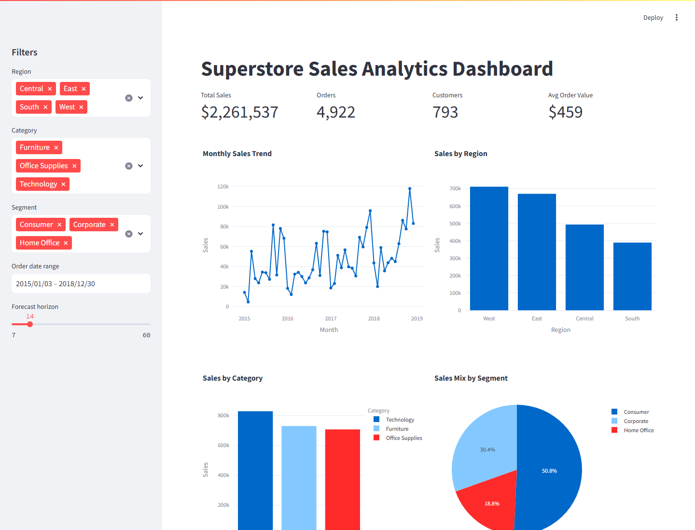
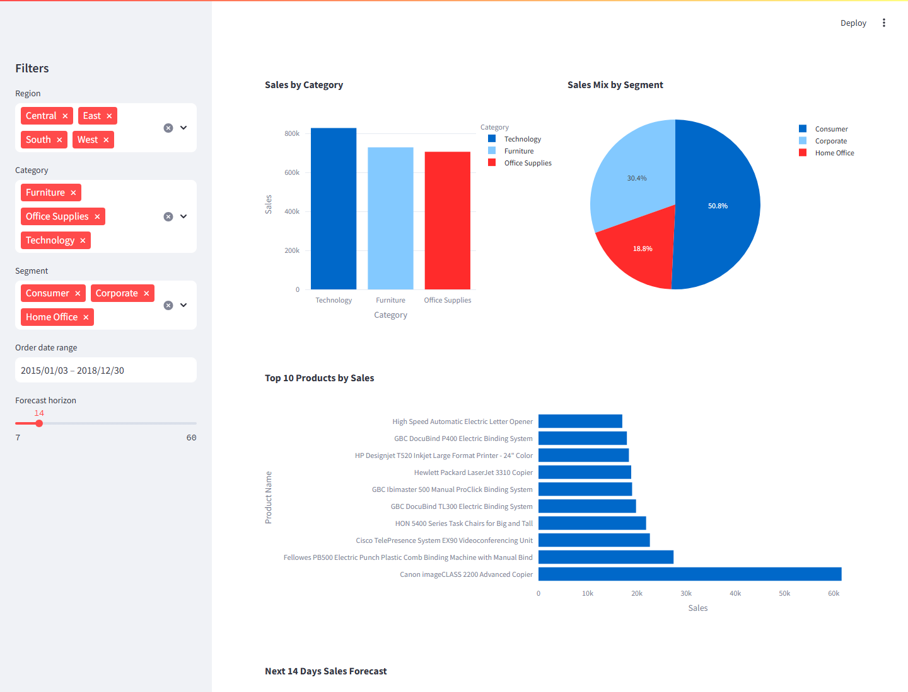
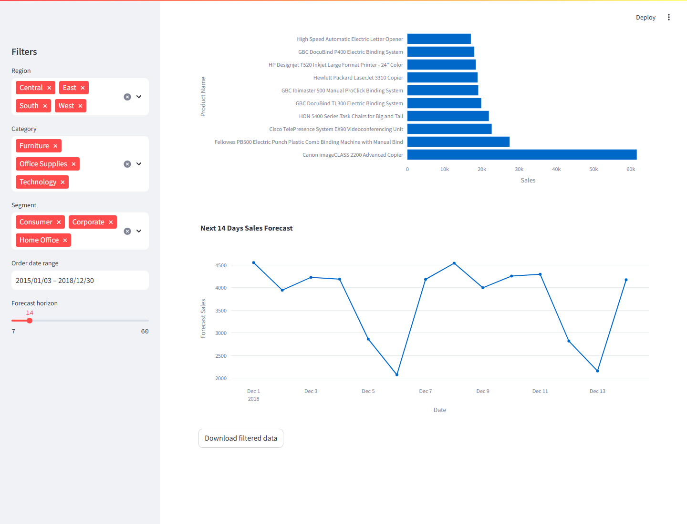

# Superstore Sales Analytics Dashboard

An end-to-end sales analytics project built with Python, Streamlit, Plotly, and time series forecasting. The goal was to turn raw Superstore order data into a dashboard that helps track sales performance across regions, categories, customer segments, products, and time.

I treated this like a small business analytics project rather than only a notebook exercise: clean the data, explore the main patterns, train a baseline forecasting model, save reusable artifacts, and build an interactive dashboard that someone can actually use.

## Dashboard Preview

### Sales Overview


### Category, Region, and Segment Analysis


### Product Ranking and Sales Forecast


## What This Project Shows

- Data cleaning and preparation with `pandas`
- Exploratory sales analysis across time, geography, category, and segment
- Interactive dashboard development with `Streamlit`
- Business-focused visualizations using `Plotly`
- Daily sales aggregation for forecasting
- SARIMAX-based time series forecasting with `statsmodels`
- Model evaluation using MAE and RMSE
- Model persistence with `joblib`
- Clear project documentation and reproducible scripts

## Business Problem

The Superstore business wants a clearer view of sales performance. The dashboard answers questions like:

- How are sales trending month by month?
- Which regions contribute the most revenue?
- Which categories and customer segments drive sales?
- What are the top-selling products?
- What could sales look like over the next few days?

The dataset provided here does not include profit, quantity, or discount columns, so I kept the analysis focused on revenue, orders, customers, products, and shipping delay. I prefer calling that out clearly instead of forcing metrics that are not present in the data.

## Dataset

Source: [Kaggle - Superstore Sales Forecasting](https://www.kaggle.com/datasets/rohitsahoo/sales-forecasting)

The dataset contains around 9,800 fictional Superstore order records with fields such as:

- Order ID and order date
- Ship date and ship mode
- Customer and segment
- City, state, postal code, and region
- Product category, sub-category, and product name
- Sales amount

## Project Structure

```text
.
├── data/
│   ├── raw/
│   │   └── train.csv
│   └── processed/
│       ├── cleaned_superstore.csv
│       └── daily_sales.csv
├── models/
│   └── sales_forecast_sarimax.joblib
├── screenshots/
│   ├── dashboard_overview.png
│   ├── dashboard_analysis.png
│   └── dashboard_forecast.png
├── dashboard.py
├── train.py
├── Superstore_Analytics.ipynb
├── HELP_GUIDE.md
├── requirements.txt
└── README.md
```

## Approach

### 1. Data Cleaning

I converted order and ship dates into proper datetime fields, handled missing postal codes, created a shipping delay feature, and removed rows that could not support analysis. The raw file was already fairly clean, so I avoided unnecessary transformations.

### 2. Exploratory Analysis

The EDA focuses on practical business views:

- Monthly sales trend
- Sales by region
- Sales by category
- Sales by segment
- Top products by revenue
- Shipping mode distribution

Monthly sales are easier to read than daily sales because the daily order pattern is noisy. I still used daily sales for forecasting because the model needs a regular time series.

### 3. Forecasting

I used a SARIMAX model with weekly seasonality as a baseline forecasting approach. It is simple enough to explain, trains quickly on this dataset, and gives a reasonable starting point before trying heavier models.

The last 30 days were used as a holdout set.

Current evaluation:

```text
MAE:  2122.54
RMSE: 2413.69
```

I would not treat this as a final production forecast. A better next version would compare SARIMAX against Prophet and lag-based machine learning models using rolling backtests.

## Dashboard Features

- KPI cards for total sales, orders, customers, and average order value
- Sidebar filters for region, category, segment, date range, and forecast horizon
- Monthly sales trend chart
- Sales by region and category
- Segment sales mix
- Top 10 products by sales
- Future sales forecast visualization
- Download button for filtered data

## Tech Stack

- Python
- pandas
- numpy
- matplotlib
- seaborn
- Plotly
- Streamlit
- scikit-learn
- statsmodels
- Prophet
- joblib

## How to Run Locally

Create and activate a virtual environment:

```bash
python -m venv .venv
.venv\Scripts\activate
```

Install dependencies:

```bash
pip install -r requirements.txt
```

Train the forecasting model:

```bash
python train.py --data-path data/raw/train.csv
```

Run the dashboard:

```bash
streamlit run dashboard.py
```

Then open:

```text
http://localhost:8501
```

## Files Worth Reviewing

- `Superstore_Analytics.ipynb` contains the notebook-based EDA and modeling workflow.
- `train.py` turns the notebook logic into a repeatable training pipeline.
- `dashboard.py` contains the Streamlit dashboard.
- `HELP_GUIDE.md` explains the project flow and code structure in more detail.

## Key Takeaways

- Technology and Furniture are major contributors to sales in this dataset.
- West and East regions show stronger revenue contribution than the other regions.
- Consumer customers make up the largest segment share.
- A few products contribute heavily to total sales, which is useful for product-level review.
- The forecast is directionally useful as a baseline, but the project would benefit from richer business features like holidays, campaigns, discounts, and profit margins.

## Improvements I Would Make Next

- Add profit, quantity, and discount fields if available.
- Use rolling cross-validation for forecasting.
- Compare SARIMAX with Prophet and lag-feature models.
- Add a simple model monitoring report.
- Improve the dashboard styling with custom Streamlit theming.
- Deploy the dashboard on Streamlit Community Cloud.

## Author

**Makarand**  
Data Science | Analytics | Machine Learning
